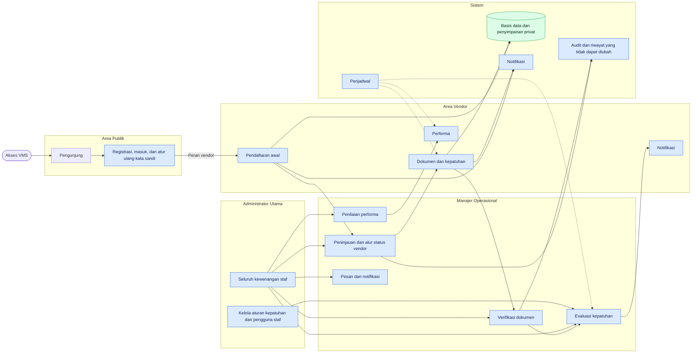
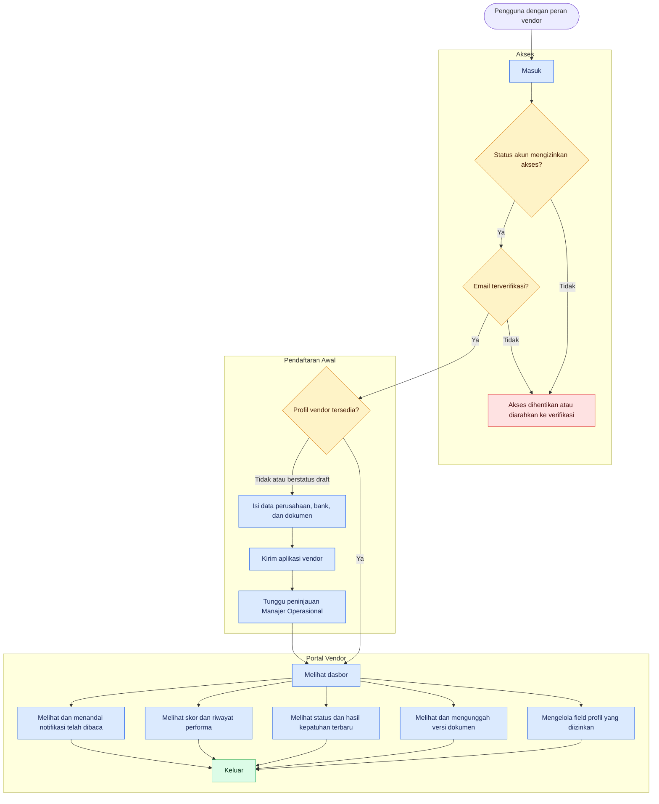
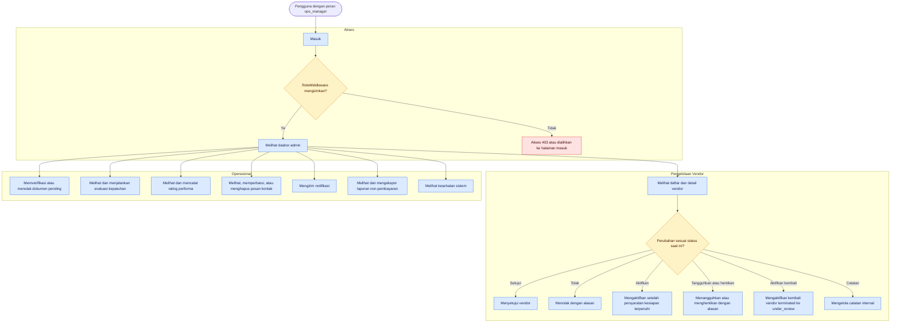
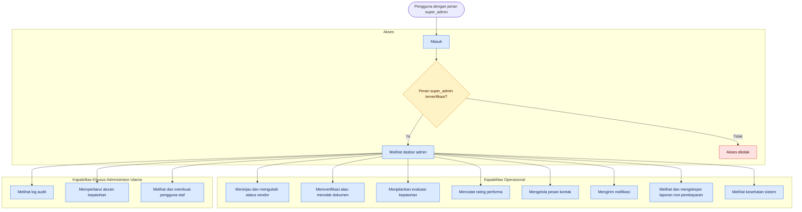
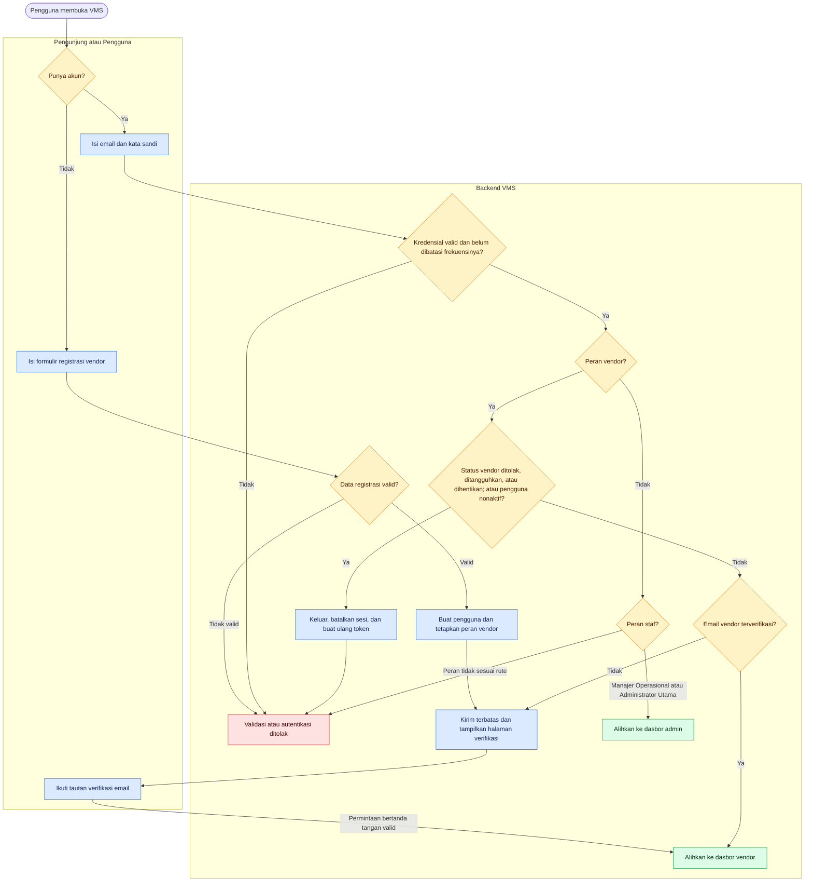
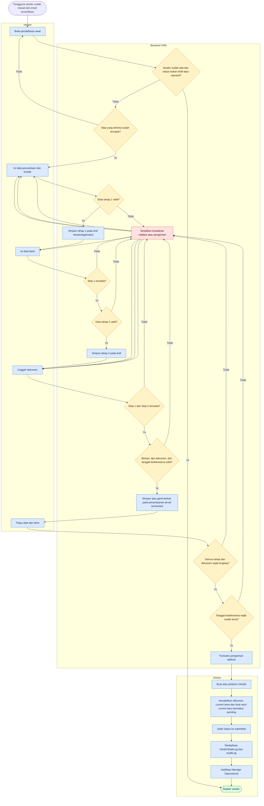
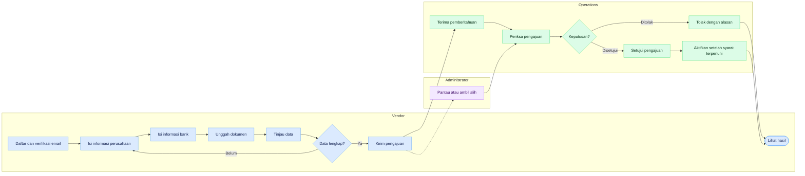
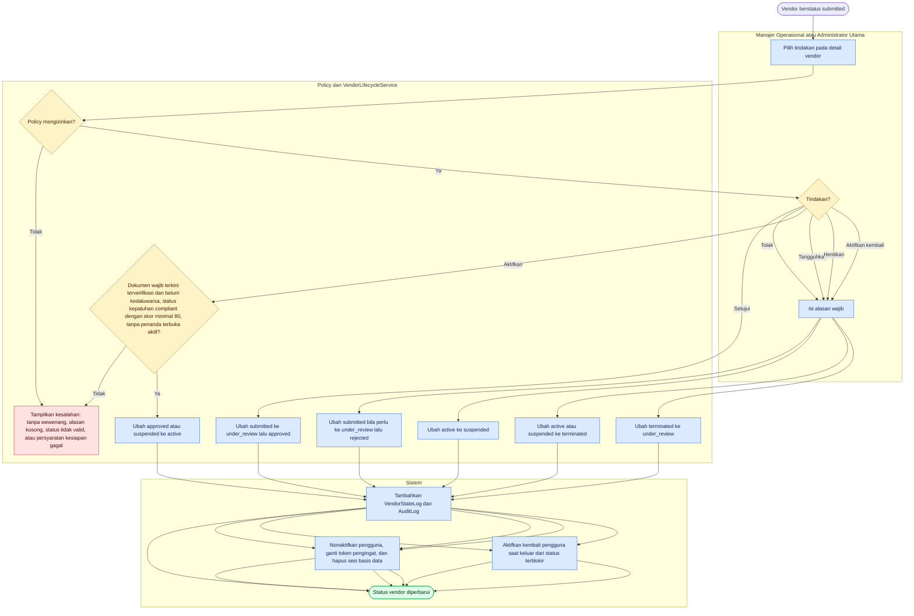
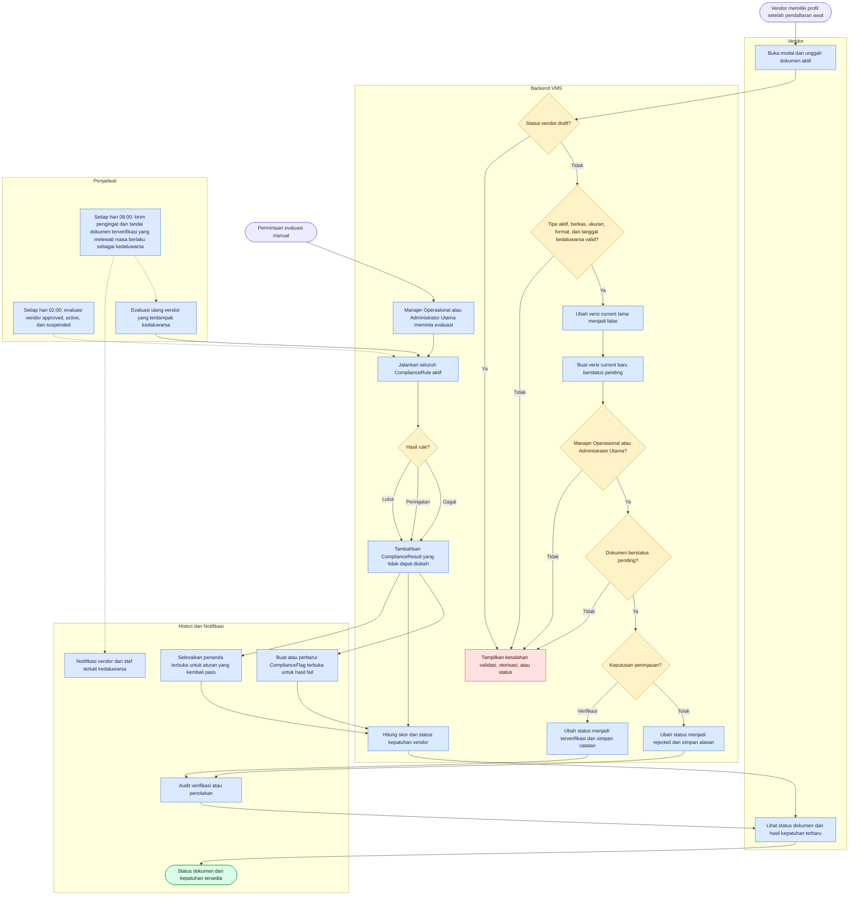
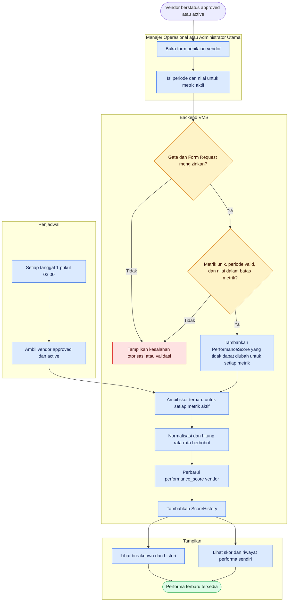

# Flowchart Proses VMS

## Tujuan

Dokumen ini memetakan proses aktif pada VMS (Vendor Management System) berdasarkan implementasi aplikasi. Diagram menggunakan Mermaid `flowchart`, konvensi diagram alir standar, dan swimlane logis. Diagram ini bukan notasi BPMN formal.

## Ruang Lingkup dan Dasar Verifikasi

- Tanggal verifikasi kode: 2026-09-24.
- Cakupan: autentikasi dan pembatasan akses, alur per peran, pendaftaran awal, alur status vendor, dokumen dan kepatuhan, serta performa.
- Batas aplikasi: proses pembayaran dan peran `finance_manager` tidak termasuk dokumentasi VMS karena digunakan pada aplikasi berbeda.
- Sumber kebenaran: rute aktif, middleware, kelas Form Request, policy/Gate, controller, service, model, penjadwal, dan halaman Inertia.
- Perilaku backend menjadi acuan apabila kontrol UI dan aturan server berbeda.
- Identitas, rekening, kredensial, dan data manual vendor tidak ditampilkan dalam dokumen ini.

## Aktor

| Aktor               | Tanggung jawab yang terverifikasi                                                                                                                                           |
| ------------------- | --------------------------------------------------------------------------------------------------------------------------------------------------------------------------- |
| Pengunjung          | Membuka halaman publik, mendaftar sebagai vendor, masuk, dan meminta reset kata sandi.                                                                                      |
| Vendor              | Memverifikasi email, menyelesaikan pendaftaran awal, mengelola profil dan dokumen, serta melihat kepatuhan, performa, dan notifikasi.                                       |
| Manajer Operasional | Meninjau vendor, mengelola alur status vendor, memverifikasi dokumen, menjalankan evaluasi kepatuhan, memberi penilaian performa, mengelola pesan, dan mengirim notifikasi. |
| Administrator Utama | Memperoleh seluruh kewenangan staf melalui `Gate::before`, termasuk pengelolaan aturan kepatuhan dan pengguna staf.                                                         |
| Penjadwal           | Menjalankan evaluasi kepatuhan harian, pemeriksaan kedaluwarsa dokumen, dan perhitungan ulang performa bulanan.                                                             |

## Legenda

| Bentuk atau gaya    | Arti                                               |
| ------------------- | -------------------------------------------------- |
| Stadium `([…])`     | Awal atau akhir proses.                            |
| Kotak `[…]`         | Aktivitas atau perubahan data.                     |
| Belah ketupat `{…}` | Keputusan dengan cabang berlabel.                  |
| Kotak biru          | Proses normal.                                     |
| Kotak kuning        | Keputusan atau kondisi yang memerlukan perhatian.  |
| Kotak merah         | Penolakan, kegagalan, atau akses dihentikan.       |
| Kotak hijau         | Hasil berhasil atau status terminal yang berhasil. |
| Garis putus-putus   | Pemicu terjadwal atau hubungan pendukung.          |

## 1. Konteks Tingkat Tinggi

## 2. Alur Peran Vendor

Diagram ini hanya memuat tindakan yang tersedia melalui rute `role:vendor`, controller vendor, dan navigasi vendor selain modul pembayaran yang berada di luar batas aplikasi.

## 3. Alur Peran Manajer Operasional

Kemampuan berikut dibuktikan oleh kelompok rute `role:ops_manager,super_admin`, Gate/policy, izin Inertia bersama, dan item navigasi yang mengizinkan `ops_manager`.

Manajer Operasional tidak dapat mengelola aturan kepatuhan, melihat log audit, atau mengelola pengguna staf karena fungsi tersebut dibatasi untuk `super_admin`.

## 4. Alur Peran Administrator Utama

`Gate::before` memberi Administrator Utama akses terhadap Gate yang terdaftar. Rute khusus Administrator Utama menambahkan log audit, aturan kepatuhan, dan pengelolaan staf di atas kemampuan operasional yang sama dengan Manajer Operasional.

## 5. Autentikasi dan Pembatasan Akses

Catatan akses:

- Seluruh rute bersama yang terautentikasi melewati `EnsureVendorAccountIsActive` dan `EnsureVendorEmailIsVerified`; pemeriksaan verifikasi email hanya membatasi vendor.
- Saat vendor masuk ke status `rejected`, `suspended`, atau `terminated`, `Vendor::transitionTo()` menonaktifkan pengguna, mengganti token pengingat, dan menghapus sesi berbasis basis data. Middleware juga memutus sesi aktif yang masih mencapai aplikasi.
- Pengaturan ulang kata sandi ditolak untuk vendor `suspended` dan `terminated`; proses masuk dan middleware juga memblokir `rejected`.
- Setelah lolos pemeriksaan bersama, `RoleMiddleware`, policy, dan Gate masih menolak tindakan yang tidak sesuai peran.

## 6. Pendaftaran Awal Vendor

## Alur Pendaftaran Vendor — Ringkas Berdasarkan Role

| Tahap                | Vendor                                                      | Operations                                                         | Administrator                                             |
| -------------------- | ----------------------------------------------------------- | ------------------------------------------------------------------ | --------------------------------------------------------- |
| Akun                 | Mendaftar dan memverifikasi email.                          | —                                                                  | —                                                         |
| Informasi perusahaan | Mengisi data perusahaan dan kontak.                         | —                                                                  | —                                                         |
| Informasi bank       | Mengisi data rekening perusahaan.                           | —                                                                  | —                                                         |
| Dokumen              | Mengunggah dokumen lalu meninjau seluruh data.              | —                                                                  | —                                                         |
| Pengiriman           | Mengirim pengajuan lengkap; ID Vendor diterbitkan otomatis. | Menerima pemberitahuan pengajuan baru.                             | Dapat memantau pengajuan.                                 |
| Pemeriksaan          | Menunggu dan melihat hasil pemeriksaan.                     | Memeriksa pengajuan lalu menyetujui atau menolak dengan alasan.    | Dapat mengambil alih pemeriksaan dan keputusan yang sama. |
| Aktivasi             | Melihat status akhir pada VMS.                              | Mengaktifkan vendor yang telah disetujui setelah syarat terpenuhi. | Dapat melakukan aktivasi dengan kewenangan yang sama.     |

Catatan sumber: alur ini diringkas dari bagian **Pendaftaran awal** dan **Alur status vendor** pada tabel [Ketertelusuran](#ketertelusuran). Profil dan ID Vendor dibuat saat pengajuan lengkap dikirim, bukan saat akun atau draf dibuat. Pengajuan ulang setelah penolakan tidak ditampilkan karena alur tersebut belum dapat diselesaikan melalui akses aplikasi saat ini; lihat [Batasan dan Ketidakpastian](#batasan-dan-ketidakpastian).

## 7. Alur Status Vendor

Status dan transisi yang diizinkan model:

| Dari           | Ke                                  |
| -------------- | ----------------------------------- |
| `draft`        | `submitted`                         |
| `submitted`    | `under_review`, `draft`, `rejected` |
| `under_review` | `approved`, `submitted`, `rejected` |
| `approved`     | `active`                            |
| `active`       | `suspended`, `terminated`           |
| `suspended`    | `active`, `terminated`              |
| `terminated`   | `under_review`, `submitted`         |
| `rejected`     | `draft`, `submitted`                |

Rute perubahan status yang aktif menyediakan tindakan approve, reject, activate, suspend, terminate, dan reactivate. Transisi lain pada tabel merupakan kemampuan mesin status dan tidak selalu memiliki rute tindakan langsung.

## 8. Dokumen dan Kepatuhan

Aturan status kepatuhan keseluruhan:

- `blocked` jika terdapat kegagalan aturan dengan penanda pemblokiran, atau lebih dari dua penanda kegagalan terbuka.
- `compliant` jika skor minimal 80 dan tidak terblokir.
- `at_risk` jika skor 50–79 dan tidak terblokir.
- `non_compliant` jika skor di bawah 50 dan tidak terblokir.
- Hanya aturan aktif yang dievaluasi. `ComplianceResult` hanya dapat ditambahkan; tampilan menggunakan hasil terbaru per vendor dan aturan sehingga riwayat lama tidak dianggap sebagai status aktif.

## 9. Penilaian Performa

## Ketertelusuran

Tautan berikut menunjuk ke sumber implementasi yang menjadi dasar diagram.

| Diagram                   | Rute aktif                                                                                                                        | Controller dan validasi                                                                                                                                                                                                                                                                                                                                                                                                                                                                                                      | Service, model, dan otorisasi                                                                                                                                                                                                                                                                                                                                                        | Antarmuka atau penjadwal                                                                                                                                                                                                                                                                                                                                                                                                                                                                                        |
| ------------------------- | --------------------------------------------------------------------------------------------------------------------------------- | ---------------------------------------------------------------------------------------------------------------------------------------------------------------------------------------------------------------------------------------------------------------------------------------------------------------------------------------------------------------------------------------------------------------------------------------------------------------------------------------------------------------------------- | ------------------------------------------------------------------------------------------------------------------------------------------------------------------------------------------------------------------------------------------------------------------------------------------------------------------------------------------------------------------------------------ | --------------------------------------------------------------------------------------------------------------------------------------------------------------------------------------------------------------------------------------------------------------------------------------------------------------------------------------------------------------------------------------------------------------------------------------------------------------------------------------------------------------- |
| Konteks                   | [`routes/web.php`](../routes/web.php), [`routes/auth.php`](../routes/auth.php)                                                    | Seluruh controller fitur yang dirinci pada baris berikut                                                                                                                                                                                                                                                                                                                                                                                                                                                                     | [`app/Providers/AppServiceProvider.php`](../app/Providers/AppServiceProvider.php), [`app/Http/Middleware/HandleInertiaRequests.php`](../app/Http/Middleware/HandleInertiaRequests.php)                                                                                                                                                                                               | [`resources/js/Pages`](../resources/js/Pages), [`routes/console.php`](../routes/console.php)                                                                                                                                                                                                                                                                                                                                                                                                                    |
| Peran Vendor              | Kelompok `role:vendor` pada [`routes/web.php`](../routes/web.php) dan [`routes/auth.php`](../routes/auth.php)                     | [`VendorController.php`](../app/Http/Controllers/VendorController.php), [`VendorOnboardingController.php`](../app/Http/Controllers/VendorOnboardingController.php), [`NotificationController.php`](../app/Http/Controllers/NotificationController.php)                                                                                                                                                                                                                                                                       | [`EnsureVendorAccountIsActive.php`](../app/Http/Middleware/EnsureVendorAccountIsActive.php), [`EnsureVendorEmailIsVerified.php`](../app/Http/Middleware/EnsureVendorEmailIsVerified.php), kelas Form Request pada [`app/Http/Requests/Vendor`](../app/Http/Requests/Vendor)                                                                                                          | [`Sidebar.jsx`](../resources/js/Components/Sidebar.jsx), [`VendorLayout.jsx`](../resources/js/Components/VendorLayout.jsx), [`resources/js/Pages/Vendor`](../resources/js/Pages/Vendor)                                                                                                                                                                                                                                                                                                                         |
| Peran Manajer Operasional | Kelompok `role:ops_manager,super_admin` dan kelompok staf bersama pada [`routes/web.php`](../routes/web.php)                      | [`VendorManagementController.php`](../app/Http/Controllers/Admin/VendorManagementController.php), [`DocumentController.php`](../app/Http/Controllers/DocumentController.php), [`ComplianceController.php`](../app/Http/Controllers/ComplianceController.php), [`PerformanceController.php`](../app/Http/Controllers/PerformanceController.php), [`ContactController.php`](../app/Http/Controllers/ContactController.php), [`AdminNotificationController.php`](../app/Http/Controllers/Admin/AdminNotificationController.php) | [`VendorPolicy.php`](../app/Policies/VendorPolicy.php), [`VendorDocumentPolicy.php`](../app/Policies/VendorDocumentPolicy.php), Gate pada [`AppServiceProvider.php`](../app/Providers/AppServiceProvider.php), izin bersama pada [`HandleInertiaRequests.php`](../app/Http/Middleware/HandleInertiaRequests.php)                                                                     | [`Sidebar.jsx`](../resources/js/Components/Sidebar.jsx), [`resources/js/Pages/Admin`](../resources/js/Pages/Admin)                                                                                                                                                                                                                                                                                                                                                                                              |
| Peran Administrator Utama | Kelompok `role:super_admin` serta seluruh kelompok Operasional pada [`routes/web.php`](../routes/web.php)                         | [`AuditLogController.php`](../app/Http/Controllers/Admin/AuditLogController.php), [`ComplianceController.php`](../app/Http/Controllers/ComplianceController.php), [`StaffUserController.php`](../app/Http/Controllers/Admin/StaffUserController.php)                                                                                                                                                                                                                                                                         | `Gate::before`, `manageComplianceRules`, dan `viewAuditLogs` pada [`AppServiceProvider.php`](../app/Providers/AppServiceProvider.php), [`StoreStaffUserRequest.php`](../app/Http/Requests/Admin/StoreStaffUserRequest.php)                                                                                                                                                           | [`Sidebar.jsx`](../resources/js/Components/Sidebar.jsx), [`Admin/Audit`](../resources/js/Pages/Admin/Audit), [`Admin/Compliance/Rules.jsx`](../resources/js/Pages/Admin/Compliance/Rules.jsx), [`Admin/Staff`](../resources/js/Pages/Admin/Staff)                                                                                                                                                                                                                                                               |
| Autentikasi dan akses     | [`routes/auth.php`](../routes/auth.php), kelompok middleware pada [`routes/web.php`](../routes/web.php)                           | [`AuthenticatedSessionController.php`](../app/Http/Controllers/Auth/AuthenticatedSessionController.php), [`RegisteredUserController.php`](../app/Http/Controllers/Auth/RegisteredUserController.php), [`EmailVerificationController.php`](../app/Http/Controllers/Auth/EmailVerificationController.php), [`LoginRequest.php`](../app/Http/Requests/Auth/LoginRequest.php)                                                                                                                                                    | [`EnsureVendorAccountIsActive.php`](../app/Http/Middleware/EnsureVendorAccountIsActive.php), [`EnsureVendorEmailIsVerified.php`](../app/Http/Middleware/EnsureVendorEmailIsVerified.php), [`RoleMiddleware.php`](../app/Http/Middleware/RoleMiddleware.php), [`Vendor.php`](../app/Models/Vendor.php)                                                                                | [`Login.jsx`](../resources/js/Pages/Auth/Login.jsx), [`Register.jsx`](../resources/js/Pages/Auth/Register.jsx), [`VerifyEmail.jsx`](../resources/js/Pages/Auth/VerifyEmail.jsx)                                                                                                                                                                                                                                                                                                                                 |
| Pendaftaran awal          | Rute `vendor.onboarding*` pada [`routes/web.php`](../routes/web.php)                                                              | [`VendorOnboardingController.php`](../app/Http/Controllers/VendorOnboardingController.php), [`StoreStep1Request.php`](../app/Http/Requests/Vendor/StoreStep1Request.php), [`StoreStep2Request.php`](../app/Http/Requests/Vendor/StoreStep2Request.php), [`StoreStep3Request.php`](../app/Http/Requests/Vendor/StoreStep3Request.php)                                                                                                                                                                                         | [`VendorService.php`](../app/Services/VendorService.php), [`VendorApplication.php`](../app/Models/VendorApplication.php), [`Vendor.php`](../app/Models/Vendor.php), [`VendorStateLog.php`](../app/Models/VendorStateLog.php)                                                                                                                                                         | [`Wizard.jsx`](../resources/js/Pages/Vendor/Onboarding/Wizard.jsx), direktori [`Steps`](../resources/js/Pages/Vendor/Onboarding/Steps)                                                                                                                                                                                                                                                                                                                                                                          |
| Alur status vendor        | Rute `admin.vendors.*` pada [`routes/web.php`](../routes/web.php)                                                                 | [`VendorManagementController.php`](../app/Http/Controllers/Admin/VendorManagementController.php)                                                                                                                                                                                                                                                                                                                                                                                                                             | [`VendorLifecycleService.php`](../app/Services/VendorLifecycleService.php), [`Vendor.php`](../app/Models/Vendor.php), [`VendorPolicy.php`](../app/Policies/VendorPolicy.php), [`VendorStateLog.php`](../app/Models/VendorStateLog.php)                                                                                                                                               | [`Admin/Vendors/Show.jsx`](../resources/js/Pages/Admin/Vendors/Show.jsx)                                                                                                                                                                                                                                                                                                                                                                                                                                        |
| Dokumen dan kepatuhan     | Rute `vendor.documents*`, `documents.*`, `admin.documents.*`, dan `admin.compliance.*` pada [`routes/web.php`](../routes/web.php) | [`VendorController.php`](../app/Http/Controllers/VendorController.php), [`DocumentController.php`](../app/Http/Controllers/DocumentController.php), [`ComplianceController.php`](../app/Http/Controllers/ComplianceController.php), [`UploadDocumentRequest.php`](../app/Http/Requests/Vendor/UploadDocumentRequest.php), [`UpdateComplianceRuleRequest.php`](../app/Http/Requests/Admin/UpdateComplianceRuleRequest.php)                                                                                                    | [`VendorService.php`](../app/Services/VendorService.php), [`ComplianceService.php`](../app/Services/ComplianceService.php), [`VendorDocument.php`](../app/Models/VendorDocument.php), [`ComplianceResult.php`](../app/Models/ComplianceResult.php), [`ComplianceRule.php`](../app/Models/ComplianceRule.php), [`VendorDocumentPolicy.php`](../app/Policies/VendorDocumentPolicy.php) | [`Vendor/Documents.jsx`](../resources/js/Pages/Vendor/Documents.jsx), [`Admin/Documents/Index.jsx`](../resources/js/Pages/Admin/Documents/Index.jsx), [`Vendor/Compliance.jsx`](../resources/js/Pages/Vendor/Compliance.jsx), [`Admin/Compliance`](../resources/js/Pages/Admin/Compliance), [`routes/console.php`](../routes/console.php), [`SendExpiryReminders.php`](../app/Console/Commands/SendExpiryReminders.php), [`EvaluateVendorCompliance.php`](../app/Console/Commands/EvaluateVendorCompliance.php) |
| Performa                  | Rute `vendor.performance` dan `admin.performance.*` pada [`routes/web.php`](../routes/web.php)                                    | [`VendorController.php`](../app/Http/Controllers/VendorController.php), [`PerformanceController.php`](../app/Http/Controllers/PerformanceController.php), [`StorePerformanceRatingRequest.php`](../app/Http/Requests/Admin/StorePerformanceRatingRequest.php)                                                                                                                                                                                                                                                                | [`PerformanceService.php`](../app/Services/PerformanceService.php), [`PerformanceScore.php`](../app/Models/PerformanceScore.php), [`PerformanceMetric.php`](../app/Models/PerformanceMetric.php), Gate pada [`AppServiceProvider.php`](../app/Providers/AppServiceProvider.php)                                                                                                      | [`Vendor/Performance.jsx`](../resources/js/Pages/Vendor/Performance.jsx), [`Admin/Performance`](../resources/js/Pages/Admin/Performance), [`routes/console.php`](../routes/console.php), [`GeneratePerformanceScores.php`](../app/Console/Commands/GeneratePerformanceScores.php)                                                                                                                                                                                                                               |

## Batasan dan Ketidakpastian

1. `VendorOnboardingController::show()` mengizinkan status `rejected` membuka pendaftaran awal, dan mesin status mengizinkan `rejected` kembali ke `draft` atau `submitted`. Namun, semua rute pendaftaran awal berada di dalam `EnsureVendorAccountIsActive`, sedangkan status `rejected` termasuk `Vendor::ACCESS_BLOCKED_STATUSES`. Akibatnya, sesi vendor berstatus `rejected` diputus sebelum mencapai pendaftaran awal. Dokumen ini tidak menggambarkan pengajuan ulang vendor berstatus `rejected` sebagai alur yang dapat diselesaikan sampai ketidaksesuaian tersebut diputuskan dan diperbaiki.
2. `ComplianceService::checkRequiredDocuments()` mengambil seluruh tipe wajib tanpa filter `is_active`, sedangkan pemeriksaan kesiapan aktivasi hanya menghitung tipe wajib aktif. Diagram mencatat evaluasi berdasarkan aturan aktif tetapi tidak menyamakan kedua cakupan dokumen tersebut.
3. Kode saat verifikasi masih memiliki peran `finance_manager`, rute, menu, model, service, penjadwal, dan halaman pembayaran. Berdasarkan keputusan bisnis, peran dan proses tersebut berada pada aplikasi berbeda sehingga sengaja tidak digambarkan sebagai alur VMS. Dokumentasi ini tidak menyatakan artefak teknis tersebut telah dihapus dari repository.
4. Navigasi vendor dan admin saat verifikasi masih menampilkan menu pembayaran. Menu tersebut tidak dimasukkan ke alur peran karena berada di luar batas aplikasi yang ditetapkan untuk dokumentasi ini.
5. `StaffUserController` dan `StoreStaffUserRequest` saat verifikasi masih mengenali `finance_manager` sebagai pilihan peran staf. Alur Administrator Utama hanya menyatakan kemampuan membuat pengguna staf dan tidak menyatakan daftar peran yang seharusnya tersedia.
6. Verifikasi atau penolakan dokumen tidak otomatis memanggil evaluasi kepatuhan dalam `DocumentController`. Evaluasi berikutnya terjadi melalui tindakan manual atau penjadwal malam; diagram menempatkan evaluasi setelah peninjauan sebagai tahapan lanjutan, bukan transaksi yang sama.
7. Laporan pembayaran dan ekspor terkait tidak dimasukkan ke alur Manajer Operasional atau Administrator Utama. Label “laporan non-pembayaran” membatasi diagram pada ringkasan vendor, performa, kepatuhan, dan kedaluwarsa dokumen yang terbukti memiliki rute aktif.
8. Validasi Mermaid dilakukan sesuai alat yang tersedia di repository. Apabila CLI Mermaid tidak tersedia, validasi terbatas pada pemeriksaan struktur source dan fence Markdown.
